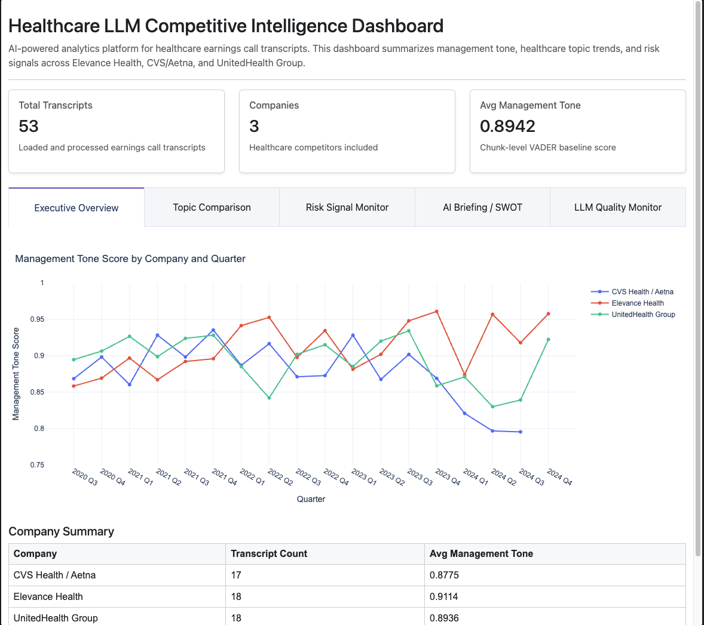
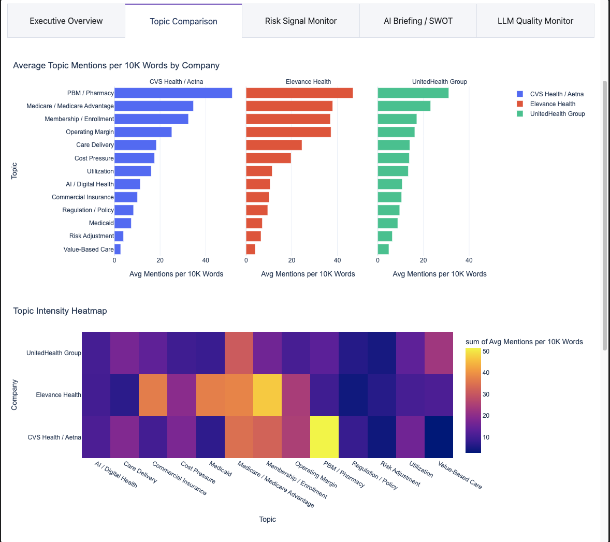
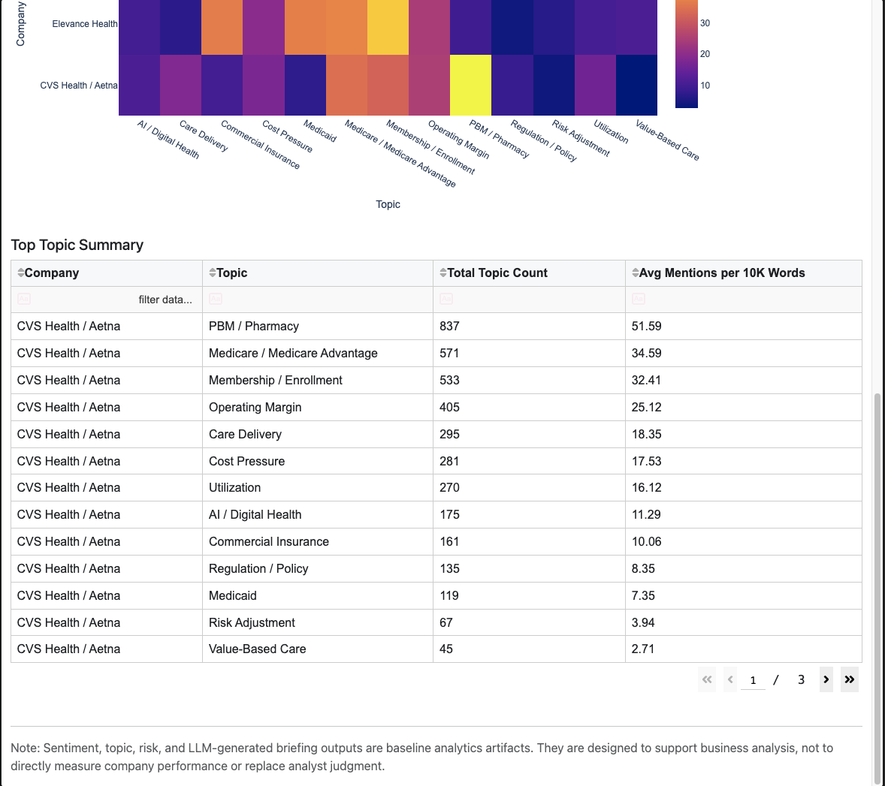
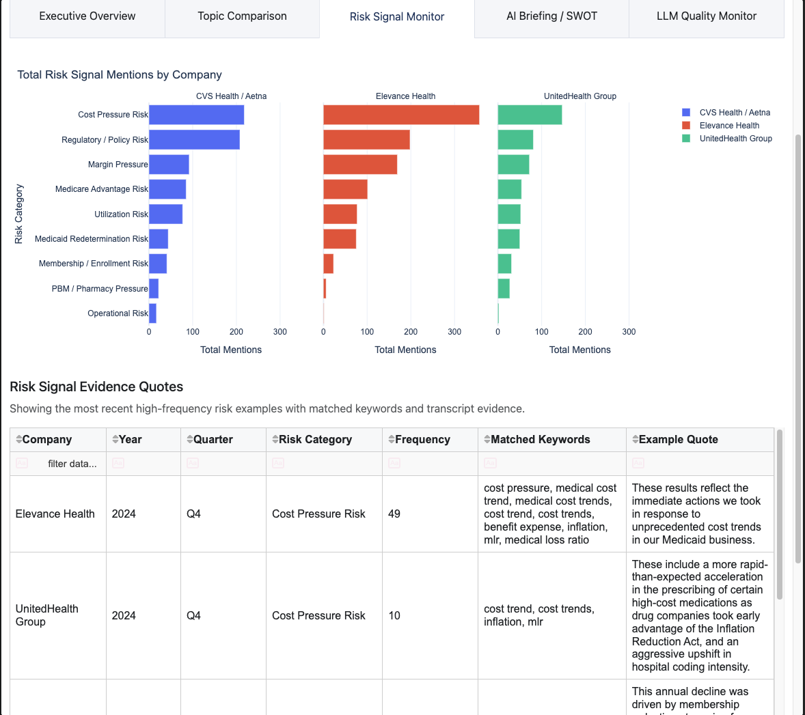
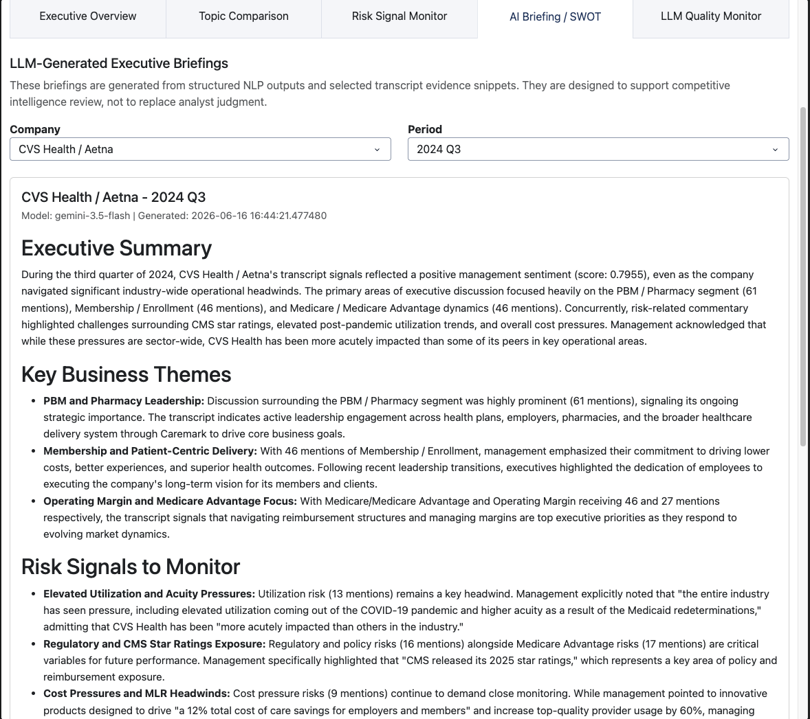
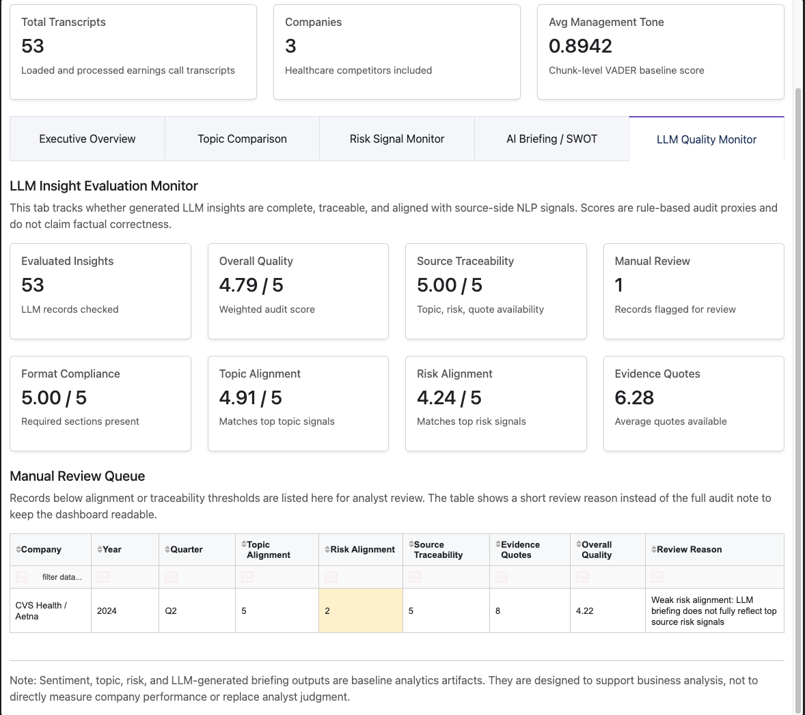

# Healthcare LLM Competitive Intelligence Analytics Platform

An AI-powered analytics platform that turns healthcare earnings call transcripts into structured competitive intelligence, NLP signals, risk monitoring, LLM-generated executive briefings, and LLM quality evaluation.

This project analyzes earnings call transcripts from **Elevance Health**, **CVS Health / Aetna**, and **UnitedHealth Group** across **2020–2024**. It was designed as a portfolio-ready data analytics / AI analytics project that demonstrates data ingestion, PostgreSQL modeling, NLP feature extraction, LLM workflow design, dashboarding, and LLM output evaluation.

---

## Dashboard Preview

### Executive Overview



### Topic Comparison





### Risk Signal Monitor



### AI Briefing / SWOT



### LLM Quality Monitor



---

## Project Summary

Healthcare payers operate in a highly competitive and regulated market. Public earnings call transcripts contain valuable signals about strategy, membership trends, cost pressure, Medicare Advantage exposure, Medicaid redeterminations, PBM/pharmacy dynamics, regulation, utilization trends, and digital health initiatives.

Reading these transcripts manually does not scale. This platform automates part of the competitive intelligence workflow by converting unstructured transcripts into structured analytics outputs and AI-assisted business insights.

The system currently processes **53 earnings call transcripts** and produces:

- Management tone and sentiment trends
- Healthcare topic intensity by company and quarter
- Risk signal extraction with transcript evidence quotes
- LLM-generated executive summaries and SWOT-style briefings
- Company and period-level dashboard filters
- LLM quality monitoring with source-traceability checks
- Manual review queue for weakly aligned LLM outputs

---

## Key Features

### Transcript Ingestion and Data Modeling

- Loaded earnings call transcript files from 2020–2024
- Parsed company, year, and quarter metadata from transcript filenames
- Stored transcript records in PostgreSQL
- Built a relational schema for companies, transcripts, sentiment scores, topic scores, risk signals, LLM insights, and LLM evaluations

### NLP Analytics Pipeline

- Applied chunk-level VADER sentiment scoring to avoid full-transcript sentiment saturation
- Built keyword-based healthcare topic classification across major payer strategy themes
- Extracted risk signals related to cost pressure, utilization, regulation, Medicare Advantage, Medicaid redetermination, PBM/pharmacy pressure, margin pressure, and operational risk
- Stored structured NLP outputs in PostgreSQL for dashboarding and LLM input grounding

### LLM Executive Briefing Generation

- Generated AI-assisted executive briefings from structured NLP outputs and transcript evidence snippets
- Produced standardized briefing sections including:
  - Executive Summary
  - Key Business Themes
  - Risk Signals to Monitor
  - SWOT Snapshot
  - Analyst Note
- Added skip-existing logic so repeated runs do not regenerate previously completed insights unless forced
- Generated full historical LLM briefings for all available transcript records

### LLM Quality Evaluation Layer

The project does not treat LLM output as ground truth. It includes a rule-based audit layer that checks whether each LLM insight is complete, traceable, and aligned with source-side analytics signals.

Current evaluation metrics include:

- Format compliance
- Topic alignment against `topic_scores`
- Risk alignment against `risk_signals`
- Source traceability through topic, risk, and evidence quote availability
- Evidence quote count
- Business relevance proxy
- Low-hallucination flag proxy
- Overall quality score
- Manual review queue

Current evaluation summary:

| Metric                            |   Result |
| --------------------------------- | -------: |
| Evaluated LLM Insights            |       53 |
| Average Overall Quality           | 4.79 / 5 |
| Average Format Compliance         | 5.00 / 5 |
| Average Topic Alignment           | 4.91 / 5 |
| Average Risk Alignment            | 4.24 / 5 |
| Average Source Traceability       | 5.00 / 5 |
| Average Evidence Quotes Available |     6.28 |
| Manual Review Records             |        1 |

The evaluation layer is an audit proxy, not a factual correctness guarantee. It is designed to flag incomplete, weakly grounded, or poorly aligned outputs for analyst review.

### Interactive Dashboard

Built with Dash, Plotly, and Dash Bootstrap Components.

Dashboard tabs include:

1. **Executive Overview**
   - Transcript count
   - Company count
   - Average management tone
   - Sentiment trend by company and quarter

2. **Topic Comparison**
   - Topic intensity by company
   - Topic trend comparison
   - Topic-level summary table

3. **Risk Signal Monitor**
   - Risk signal frequency by company and category
   - Transcript evidence quotes supporting risk signals

4. **AI Briefing / SWOT**
   - LLM-generated executive briefings
   - Company filter
   - Period filter
   - Standardized summary and SWOT-style output

5. **LLM Quality Monitor**
   - LLM evaluation metrics
   - Source traceability score
   - Topic and risk alignment scores
   - Manual review queue with short review reasons

---

## Tech Stack

### Data and Backend

- Python
- Pandas
- NumPy
- SQLAlchemy
- PostgreSQL
- Regex-based transcript parsing

### NLP and AI

- VADER sentiment analysis
- Keyword-based topic classification
- Risk signal extraction
- Google Gemini API for LLM briefings
- Prompt templates for structured executive summaries and SWOT-style analysis

### Dashboard

- Dash
- Plotly
- Dash Bootstrap Components
- Dash DataTable

### Development Tools

- VS Code
- Python virtual environment
- psql
- Git / GitHub

---

## Data Coverage

Current transcript coverage:

| Company            | Transcript Count | LLM Insight Count |
| ------------------ | ---------------: | ----------------: |
| CVS Health / Aetna |               17 |                17 |
| Elevance Health    |               18 |                18 |
| UnitedHealth Group |               18 |                18 |
| **Total**          |           **53** |            **53** |

Every loaded transcript has a corresponding LLM insight.

---

## Project Architecture

```text
Raw Earnings Call Transcript Files
        |
        v
Transcript Ingestion and Metadata Parsing
        |
        v
PostgreSQL Database
        |
        v
Text Cleaning and NLP Feature Extraction
        |
        |-- Sentiment Scores
        |-- Topic Scores
        |-- Risk Signals
        |-- Evidence Quotes
        |
        v
LLM Insight Generation
        |
        |-- Executive Summary
        |-- Key Business Themes
        |-- Risk Signals
        |-- SWOT Snapshot
        |-- Analyst Note
        |
        v
LLM Evaluation Layer
        |
        |-- Format Compliance
        |-- Topic Alignment
        |-- Risk Alignment
        |-- Source Traceability
        |-- Manual Review Queue
        |
        v
Dash + Plotly Dashboard
```

---

## Database Tables

Core tables include:

- `companies`
- `transcripts`
- `sentiment_scores`
- `topic_scores`
- `risk_signals`
- `llm_insights`
- `llm_evaluations`

The database design supports traceability from dashboard outputs back to source transcripts and intermediate NLP signals.

---

## Example Workflow

### 1. Load transcripts

```bash
python -m src.ingestion.load_transcripts
```

### 2. Run NLP pipeline

```bash
python -m src.pipeline.run_pipeline --mode nlp
```

### 3. Generate LLM insights for a specific quarter

```bash
python -m src.llm.generate_summary --year 2024 --quarter Q4
```

### 4. Regenerate an existing insight when needed

```bash
python -m src.llm.generate_summary --company "UnitedHealth Group" --year 2024 --quarter Q4 --force
```

### 5. Evaluate LLM output quality

```bash
python -m src.llm.evaluate_insights
```

### 6. Start the dashboard

```bash
python dashboard/app.py
```

Dashboard URL:

```text
http://127.0.0.1:8050/
```

---

## LLM Evaluation Philosophy

This project uses LLMs as an analyst-assist layer, not as an unquestioned source of truth.

The LLM output is generated from structured signals such as sentiment scores, topic intensity, risk signal frequency, and transcript evidence snippets. A separate evaluation layer then checks whether the generated insight is complete, aligned with source-side NLP outputs, and traceable to evidence.

This design supports a more realistic enterprise AI workflow:

```text
Generate insight → evaluate quality → flag weak outputs → analyst review
```

---

## Business Value

This platform helps analysts quickly answer questions such as:

- Which healthcare themes are competitors emphasizing over time?
- How does management tone change across companies and quarters?
- Which companies show stronger exposure to Medicare Advantage, Medicaid, PBM, or cost pressure?
- What risk signals are repeatedly appearing in earnings calls?
- Which LLM-generated insights are well-aligned with source evidence?
- Which outputs require manual analyst review?

---

## Current Status

Completed:

- Transcript ingestion for 53 earnings call transcripts
- PostgreSQL schema and analytics tables
- Sentiment scoring pipeline
- Healthcare topic classification
- Risk signal extraction with evidence quotes
- LLM executive briefing and SWOT generation
- Full 2020–2024 LLM insight coverage
- Company and period filters in AI briefing dashboard
- LLM output evaluation layer
- LLM quality monitor dashboard tab
- Manual review queue for weakly aligned outputs

Planned next steps:

- Add transcript upload workflow
- Add analyze button for a single company/year/quarter
- Add company-year batch analysis mode
- Add optional prompt template selector
- Add deployment instructions

---

## Why This Project Matters

This project demonstrates more than basic LLM summarization. It shows an end-to-end analytics workflow that combines:

- Structured data modeling
- NLP feature engineering
- Business-focused risk analysis
- LLM generation
- Evidence-grounded output design
- Quality evaluation
- Dashboard-based decision support

The result is a practical competitive intelligence platform that mirrors real analyst workflows used in healthcare strategy, market research, and AI-assisted business intelligence.
